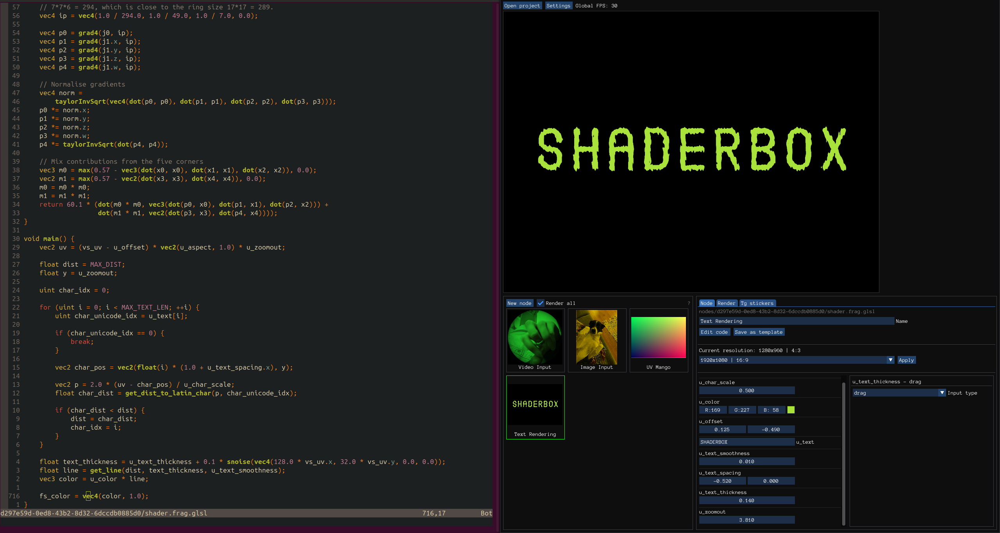
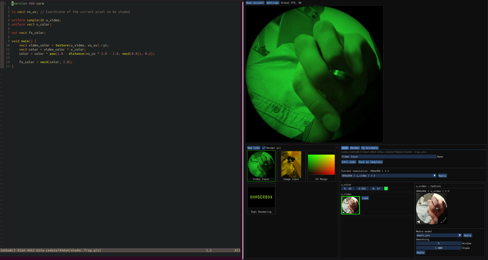
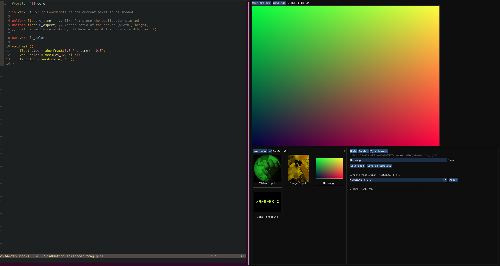

# ShaderBox - Interactive GLSL shaders editor
A real-time GLSL fragment shader editor with automatic uniform detection and visual interface generation.

Download on [itch.io](https://where-is-your-keyboard.itch.io/shaderbox)

## Features:
- Live shader editing with automatic recompilation
- Automatic uniform detection from shader code with UI generation
- Support for various uniform types: vectors, colors, textures, arrays, and text
- Image and video texture inputs
- Export rendered shaders to images, videos, or Telegram stickers
- Integration with ModelBox for AI-powered image processing (depth maps, background removal)

ShaderBox automatically analyzes your GLSL code and creates appropriate UI controls for uniforms, making it easy to experiment with parameters in real-time. The editor handles texture loading, uniform management, and rendering output automatically.

## Quick Start
- Install uv: https://docs.astral.sh/uv/
- Run: `uv sync`
- Run: `uv run python ./shaderbox/ui.py`
