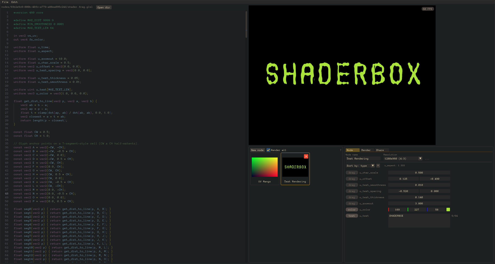
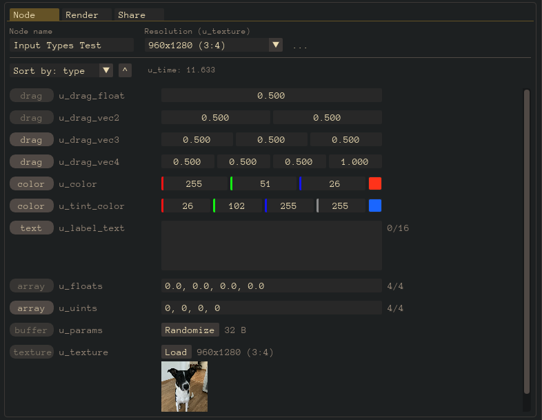
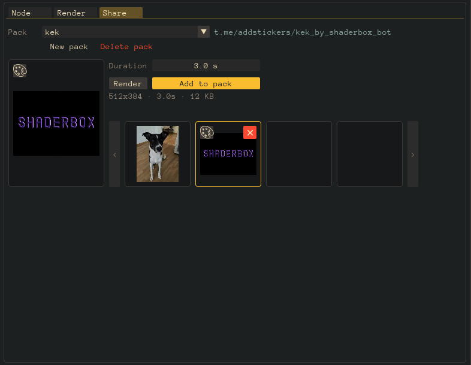
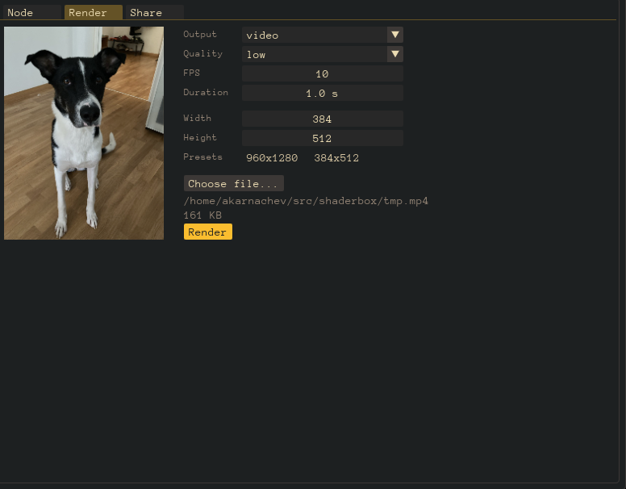

# ShaderBox - Interactive GLSL shaders editor
A real-time GLSL fragment shader editor with automatic uniform detection and visual interface generation.

Download on [itch.io](https://where-is-your-keyboard.itch.io/shaderbox)

## Features:
- Built-in syntax-highlighted GLSL editor — Ctrl+S to save and hot-reload instantly (external files hot-reload on change too)
- Automatic uniform detection from shader code with UI generation
- Support for various uniform types: vectors, colors, textures, arrays, and text
- Image and video texture inputs
- Built-in freetype glyph-atlas text-rendering shader
- Export rendered shaders to images, videos, or Telegram stickers
- Gruvbox UI

ShaderBox automatically analyzes your GLSL code and creates appropriate UI controls for uniforms, making it easy to experiment with parameters in real-time. The editor handles texture loading, uniform management, and rendering output automatically.

## Quick Start
- Install uv: https://docs.astral.sh/uv/
- Run: `uv sync`
- Run: `uv run python ./shaderbox/ui.py`
