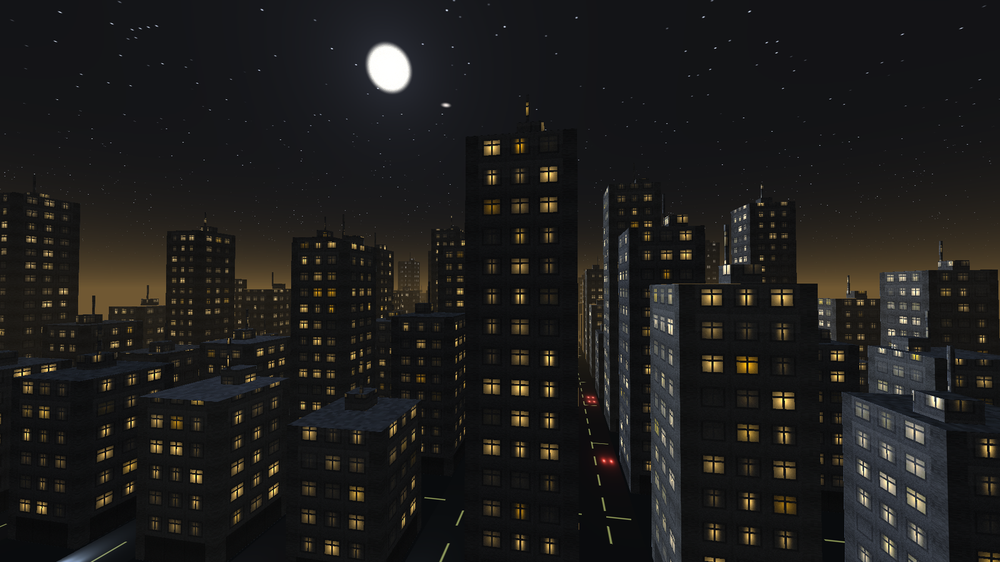

# ShaderBox

**A desktop playground for GLSL shaders.** Write a fragment shader, get an instant control panel for
every uniform in it, and watch the render change as you drag.



*The scene above is one shader file, shipped as an example. Every part of it - camera, building
density, window warmth, traffic, fog - is a slider ShaderBox built by reading the code.*

[**Download for Linux or Windows on itch.io**](https://where-is-your-keyboard.itch.io/shaderbox)

## The idea

Writing a shader usually means hard-coding a constant, recompiling, squinting, changing it,
recompiling again. ShaderBox removes that loop:

```glsl
uniform float u_glow = 0.8;      // a drag appears
uniform vec3  u_tint_color;      // a color picker appears
uniform sampler2D u_image;       // an image slot appears
```

Declare a uniform, save, and the control is there - nothing to register, no UI code to write.
`Ctrl+S` recompiles in place, so the picture updates while you are still looking at it.

## What else is in the box

- **Examples to pull apart.** `Alt+E` opens a gallery of complete shaders - the city above, a fire,
  a text-rendering piece. Open a copy and take it apart.
- **A shader library.** Call `SB_fbm(...)` or `SB_sd_circle(...)` straight from your code, no
  `#include` - SDF shapes and operators, noise, glow, and a full text stack are already there.
- **Python on top of GLSL.** A node can carry a script that drives its uniforms every frame, for the
  things a stateless shader cannot do - a physics step, an integrator.
- **An AI copilot** (optional, bring your own OpenRouter key). It edits your shader, the engine
  recompiles in-process, and the compile errors go straight back to the model - so it fixes its own
  GLSL instead of handing you something broken. Destructive actions wait for a confirm; any turn
  reverts in one click.
- **Export.** An image, a video, a Telegram sticker set, or straight to YouTube.
- **Keyboard-first.** Rebindable chords, a command palette, `F1` for in-app help.

## Install

Needs [uv](https://docs.astral.sh/uv/):

```
uv sync
uv run python ./shaderbox/ui.py
```

Or grab a build from [itch.io](https://where-is-your-keyboard.itch.io/shaderbox) - it ships as source
and bootstraps itself on first launch.

## Built with

Python 3.12, [moderngl](https://github.com/moderngl/moderngl), [glfw](https://www.glfw.org/), and
[Dear ImGui](https://github.com/pthom/imgui_bundle) via imgui-bundle.

## License

GPL-3.0-or-later - use it, study it, share it, modify it; distributed derivatives stay under the same
license with source available. See [LICENSE](./LICENSE).
