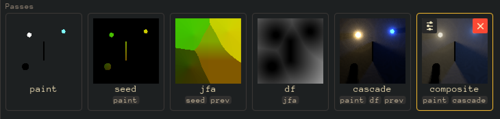

# 070 — What a pass reads, on its tile

Status: **done**. Opened as "the graph view of the pass strip" (069 #19 option A); closed as a
row of chips under each tile, after a brainstorm that rejected the graph view. This file records
the decision and what shipped.

## Goal

The strip shows six thumbnails of the Radiance Cascades example and nothing about how they
connect. 069 #19 asked for the wiring to be visible without opening the gear, and the first
answer, one `u_x <- y` line per input, was cut at the tile's width and dropped in 069 W-D.

## The brainstorm (2026-09-03)

Six layouts were mocked as a local HTML page over the real six-pass example, each at panel
widths from 480 to 1040, with a click setting the output so the stale tint could be judged:

- **arcs over the strip**, **ranked columns with beziers**, and the same **in a popup**: rejected,
  the maintainer's word was "messy"; every arc layout also degrades at 480, where the strip wraps
  and an edge has nowhere to go;
- **an outline tree from the output**: rejected, "too many clicks machinery for nothing useful";
- **rows top to bottom with git-log lanes**, and two horizontal versions of it (a dot rail above
  the strip; lanes leaving the tiles): liked, but the horizontal ones trade wrapping for a
  sideways scroll, and the vertical one is a second layout beside the strip;
- **the strip with chips**: chosen. "Looks simple and it seems like a user needs nothing more."

Decision: **no graph view.** The strip is the one view of the passes; each tile names what it
reads. The `imgui_node_editor` question is closed with it.

## What shipped

- `ui_primitives.preview_cell` takes `chips` + `chip_font`: one more line under the footer, each
  word on a small chip, centered; chips that do not fit collapse into a `+N` count. The line is
  reserved whenever `chips` is given, so every tile in a strip has the same height. The row spans
  the cell's width to a 2px inset, not the padded content region: three short names need 97px
  and the padded region is 96. Chips dim with the stale tint.
- `text_chip` is the shared word-on-a-chip primitive; the Help body's inline code chip now draws
  through it.
- `pass_list._reads`: the chips are the passes a tile reads from the effective wiring
  (`Document.effective_wiring`, 072), in strip order, one per source pass however many samplers
  read it, then `prev` when the pass reads its own previous frame. A read is what the binder
  binds: a source whose sampler the compiled program does not declare (the maintainer's first
  break: `u_paint` renamed to `u_paint0`) samples nothing, so it is no chip; a source naming a
  pass that no longer exists binds black, so it is no chip either. The uniform name and the run
  count stay off the tile.
- Tests: `test_pass_verbs.py` pins the chips a wired tile carries (source once, `prev` last,
  never a uniform) and the missing-source case; `test_ui_prose_budget.py` lists the two chip
  sites as unmeasurable (they forward a pass name / a code span).

## Manual verification

Open the Radiance Cascades example and look at the strip:

1. `cascade` shows `paint df prev` on one line, no `+1`.
2. Pick `df` as output: the three later tiles dim, chips included.
3. Add a pass with four inputs and check the `+N` collapse reads, not clips.
4. Rename `u_paint` to `u_paint0` in `seed`: its `paint` chip goes with the wire; rename it
   back and the chip returns.
5. The chip row on the one-pass examples is an empty line; judge whether the extra height under
   `main` is acceptable or the line should collapse for a document with no reads at all.
